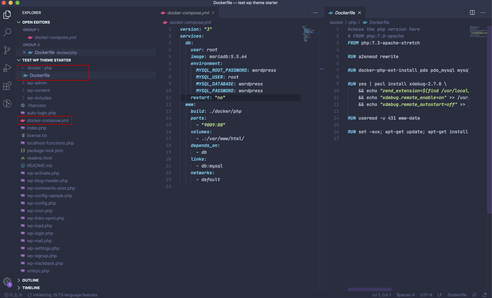
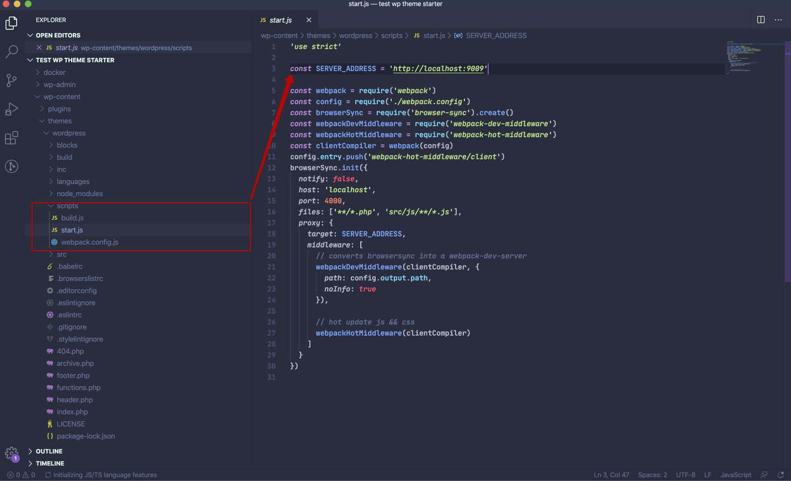
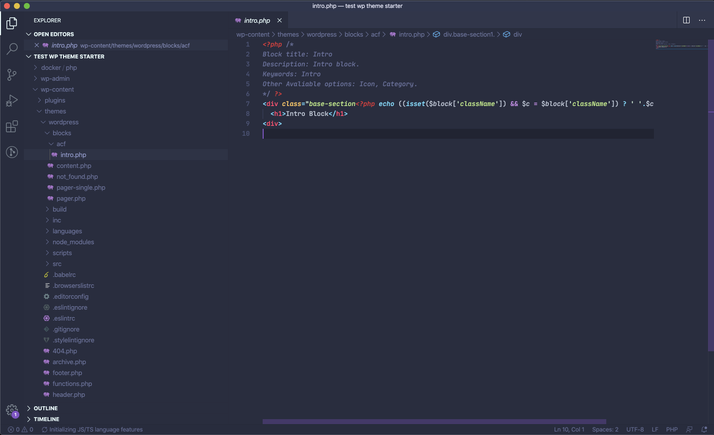
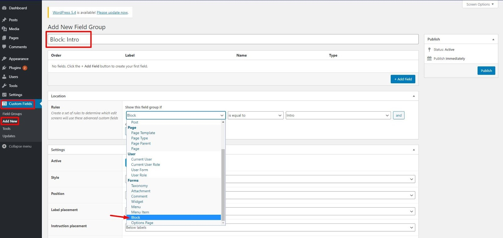

# WP Theme Starter Docker

- [WP Theme Starter Docker](#wp-theme-starter-docker)
	- [Features](#features)
	- [Requirements](#requirements)
	- [Getting Started](#getting-started)
	- [Developing Locally](#developing-locally)
	- [Building for Production](#building-for-production)
	- [Working with WP Gutenberg blocks and templates](#working-with-wp-gutenberg-blocks-and-templates)
	- [Project Structure](#project-structure)

## Features

- Modern JavaScript through Webpack
- Live reload via BrowserSync
- SCSS support
- Easy dev environments with Docker Compose
- Stateless, immutable plugin management via Composer
- Helpful HTML5 Router for firing JS based on WordPress page slug.

## Requirements

- Node.js >= 8.11.3
- Yarn(Optional)
- Docker for Mac / Windows
- Docker Compose

## Getting Started

1. ### Prepare Wordpress

To work locally with wordpress, you will need to set up a local server. It can be Openserver, WAMP, MAMP, XAMPP docker or any other program that can provide local php + mysql server
Example of a docker-compose.yml file:
```yml
version: "3"
services:
  db:
    user: root
    image: mysql
    environment:
      MYSQL_ROOT_PASSWORD: wordpress
      MYSQL_USER: root
      MYSQL_DATABASE: wordpress
      MYSQL_PASSWORD: wordpress
  www:
    build: ./docker/php
    ports:
      - "9009:80"
    volumes:
      - .:/var/www/html/
    depends_on:
      - db
    links:
      - db:mysql
    networks:
      - default
```
For setting up an apache server via docker add a file to your WP root folder, located at "/docker/php/Dockerfile" and add this code to the file

```dockerfile
#chose the php version here
# FROM php:7.0-apache
FROM php:7.3-apache-stretch

RUN a2enmod rewrite

RUN docker-php-ext-install pdo pdo_mysql mysqli

RUN yes | pecl install xdebug-2.7.0 \
    && echo "zend_extension=$(find /usr/local/lib/php/extensions/ -name xdebug.so)" > /usr/local/etc/php/conf.d/xdebug.ini \
    && echo "xdebug.remote_enable=on" >> /usr/local/etc/php/conf.d/xdebug.ini \
    && echo "xdebug.remote_autostart=off" >> /usr/local/etc/php/conf.d/xdebug.ini

RUN usermod -u 431 www-data

RUN set -eux; apt-get update; apt-get install -y libzip-dev zlib1g-dev; docker-php-ext-install zip
```


2. ### Install WordPress

For wordpress installation can be used clear wordpress files (downloaded from wordpress.org).
Using docker, database credentials can be seen in docker-compose.yml file:  
```yml
MYSQL_ROOT_PASSWORD: wordpress
MYSQL_USER: root
MYSQL_DATABASE: wordpress
MYSQL_PASSWORD: wordpress
```
After install of new wordpress replace the whole wp-content folder with your folder (from a live site or provided via zip archive) that contains the theme and plugins.

3. ### Syncing Wordpress

To continue development of the site, import provided sql file (replacing http://MYSITE with your localhost name) or sync the database from live to your local staging. You can use "WP Sync DB" (following this official guide https://www.youtube.com/watch?v=IFdHIpf6jjc ) or any other method convenient to you.

4. ### Preparing to local development

Open theme folder in console terminal and install required dependencies using command.

```bash
npm i
```
5. ### Changing ports

Navigate to /YOURTHEME/scripts/start.js and make sure that SERVER_ADDRESS is set to your localhost address.

## Developing Locally

To work on the theme locally, open theme folder in terminal and run:

```bash
npm start
```

This will open a browser, watch all files (php, scss, js, etc) and reload the
browser when you press save.

## Building for Production

To create an optimized production build, run:

```bash
npm run build
```

This will minify assets, bundle and uglify javascript, and compile scss to css.
It will also add cachebusting names to then ends of the compiled files, so you
do not need to bump any enqueued asset versions in `functions.php`.

## Working with WP Gutenberg blocks and templates

To add a new block, simply navigate to /YOURTHEME/blocks/acf/ and create a new file. That's enough to make the block visible on the backend to work with it.



When a new block is added, navigate to your WP admin panel -> Custom fields -> Add new. After required fields are added, you will need to set up location rules. Under the fields section, choose from dropdowns “Block” -> “Is equal to” -> “block-name”



After that you can add this block to your page and edit it.

## Project Structure

```bash
.
├── footer.php
├── functions.php
├── header.php
├── index.php
├── package.json                 # Node.js dependencies
├── page.php
├──scripts                       # Build / Dev Scripts
│   ├── build.js                 # Build task
│   ├── start.js                 # Start task
│   └── webpack.config.js        # Webpack configuration
└──src
	├── js
	│   ├── main.js                 # JavaScript entry point
	│   ├── utils                  	# JS utils helpers
	│   │   ├── detectTouch.js           
	│   │   ├── resizeHandler.js
	│   │   └── responsiveHelper.js
	│   │   └── polyfills.js        	     
	├── fonts
	│   └── ... 					 #Fonts directory
	├── images
	│   └── ...						 #Images directory
	├── styles           
	│ 	├── style.scss               # SCSS style entry point
	│  	├── libs.scss                # SCSS libs entry point
	│ 	├── base                   	 # Base styles and elements
	│ 	│   └── ...
	│ 	├── abstracts                # Configuration and helpers
	│ 	│   └── ...
	│ 	├── vendors                  # Vendors
	│ 	│   └── ...
	│ 	├── layout                   # Layout-related sections
	│ 	│   └── ...
	│ 	├── components               # Components style
	│ 	│   └── ...
	│ 	├── pages                    # Page-specific styles
	│ 	│   └── ...
	│ 	├── themes                   # Themes
	│ 	│   └── ...    
```
